# Bored — Android

**An offline-first activity recommender that turns "I'm bored" into something to do.**
Shake your phone or tap a button to get a fresh idea, filter by category, save favourites, and
keep one recommendation on your home screen. Built as a showcase of modern, production-grade
Android engineering.

[](https://github.com/uszkaisandor/bored-android/actions/workflows/ci.yml)


<p align="center">
  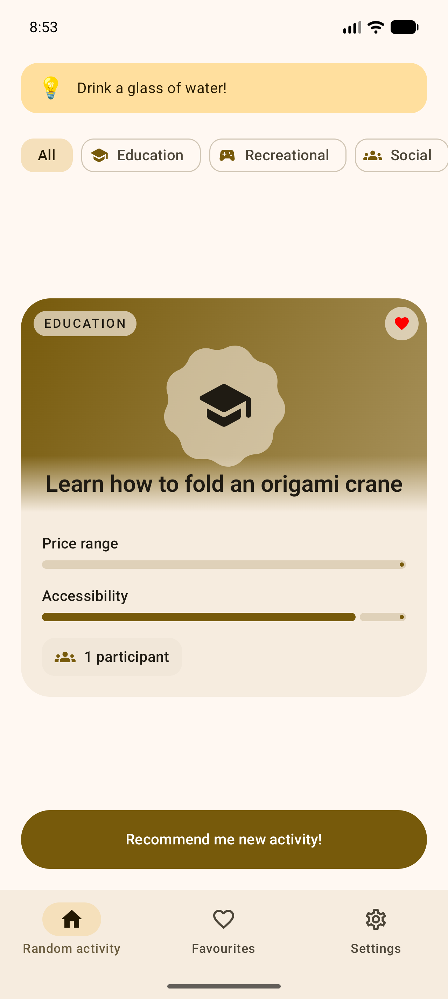
  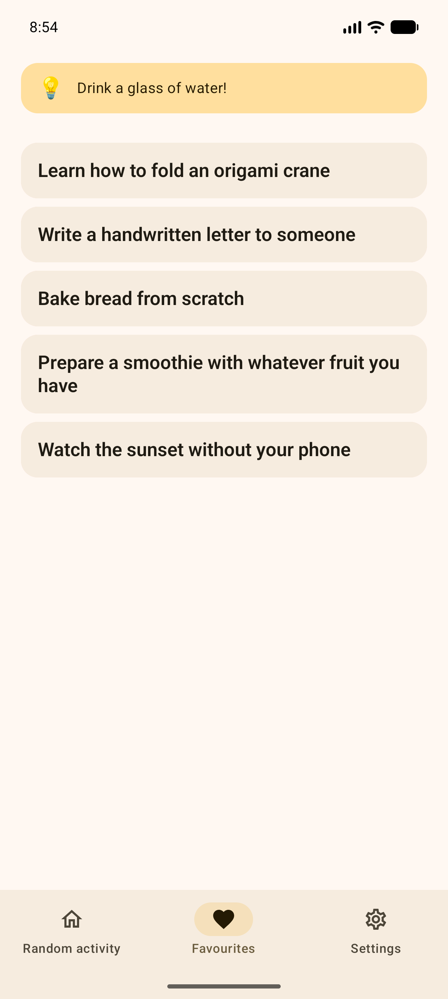
  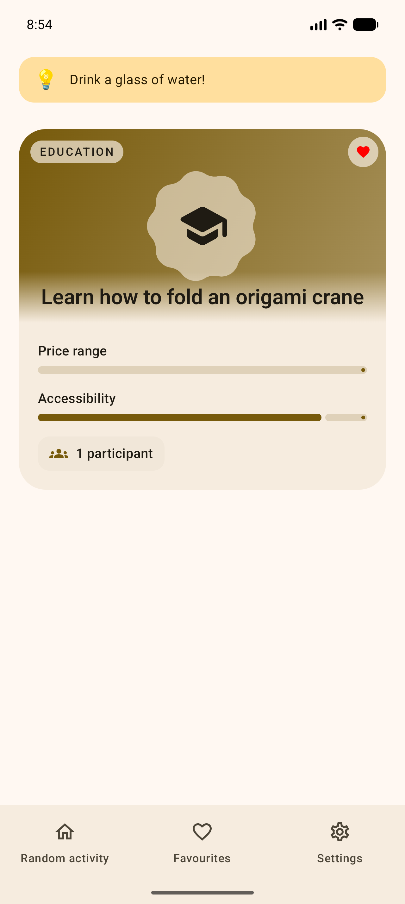
</p>

## Shared-element transition

The activity title is a true shared element that travels from the favourites row to the detail
header — the connective thread between the two screens, not a container that inflates.

<p align="center">
  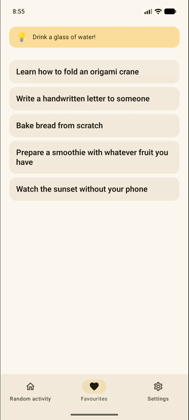
</p>

## Light & dark

A hand-tuned brand palette with genuine per-category accent colors in both themes.

<p align="center">
  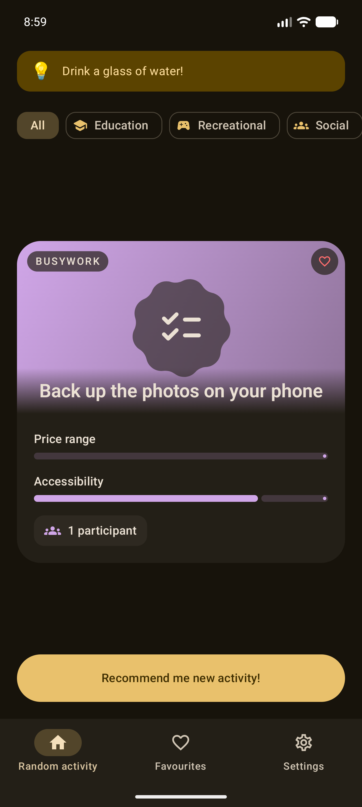
  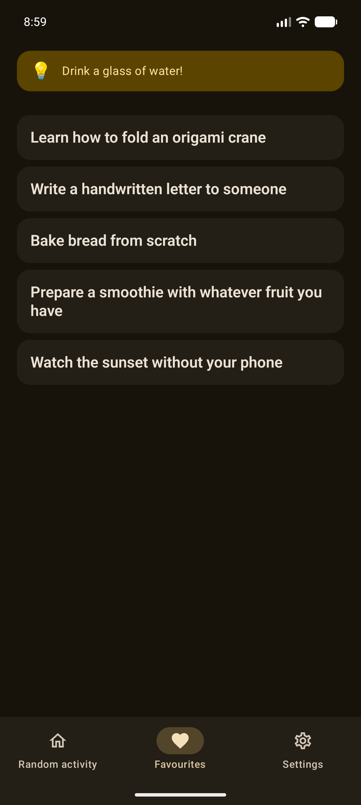
  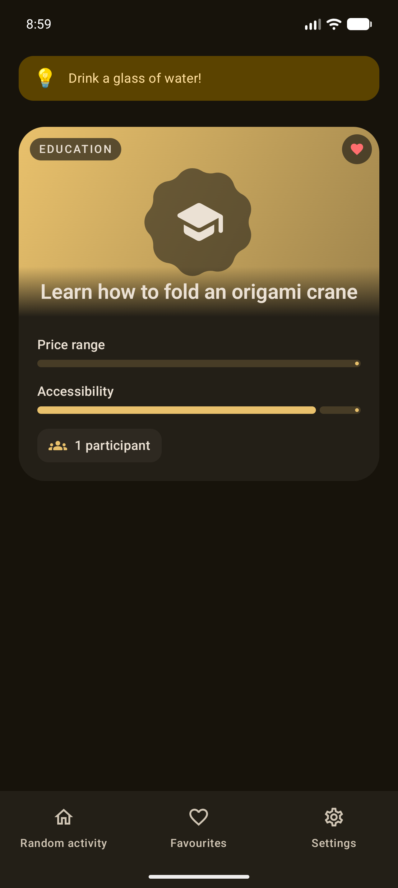
</p>

## Features

- **Random recommendation** with a category filter (Education, Recreational, Social, DIY, …).
- **Shake to shuffle** — a debounced sensor gesture rerolls the current activity.
- **Favourites** — Paging 3 list with swipe-to-delete and a Lottie empty state.
- **Detail screen** reached through a shared-element title transition, with predictive back.
- **Material 3 Expressive** — motion scheme, expressive shapes, per-category accent colors.
- **Dynamic color (Material You)** — optional wallpaper-based theming on Android 12+, with the
  extended accents harmonized to the wallpaper; a hand-tuned brand palette otherwise.
- **Designed haptics** — deliberate `Vibrator`-backed feedback for confirm / shuffle / toggle / tick.
- **Home-screen widget** (Glance) showing one activity with a refresh action.
- **Settings** — persisted theme (System / Light / Dark) and a dynamic-color toggle (DataStore).
- **Offline-first** — a curated dataset is bundled and seeded into Room on first run (the original
  Bored API is defunct), so the app works with no network.

| Dynamic color (Material You) | Empty state | Settings |
| :--: | :--: | :--: |
| 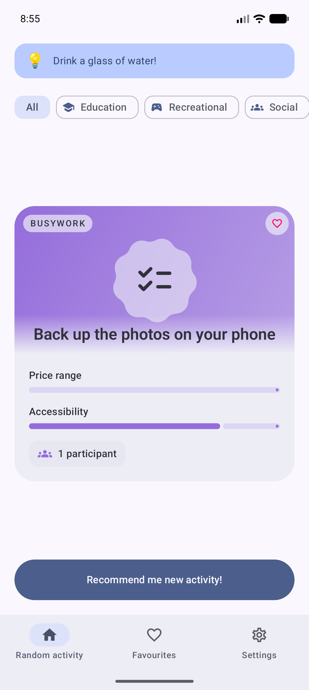 | 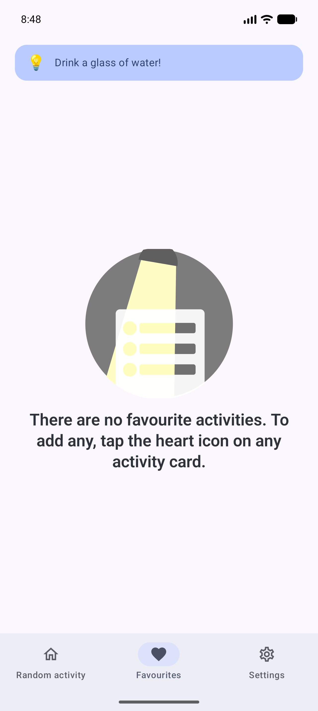 | 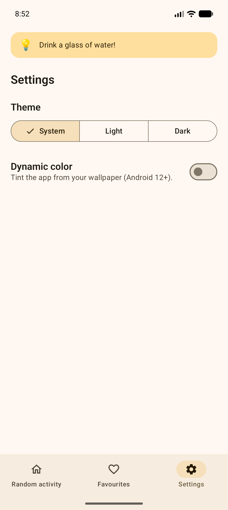 |

## Architecture

Clean, layered, multi-module. Dependencies point strictly downward
(`presentation → domain`, `data → domain`, feature → core); `core:domain` is pure Kotlin so a
future Kotlin Multiplatform move stays cheap.

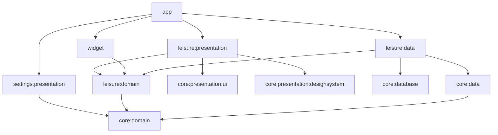

**Key patterns**

- **Repository over a data-source seam.** `LeisureActivityRepositoryImpl` depends on a
  `LeisureLocalDataSource` interface; `RoomLeisureLocalDataSource` is the only place the Room
  `@Dao` is referenced — the framework stays out of the repository and both become unit-testable.
- **Typed errors.** Repositories return `Flow<Outcome<T>>` (`Success` / `Failure(DomainError)`)
  instead of throwing; every screen models `Loading / Content / Error` as a sealed `UiState` with
  retry. Optimistic favourite toggles roll back on failure.
- **Injected dispatchers.** A `DispatcherProvider` replaces hard-coded `Dispatchers.IO`, so tests
  run on a deterministic `TestDispatcher`.
- **DI with Koin** (DSL, no annotations); **Navigation 3** with feature-owned nav keys; **MVVM**
  with a shared `BaseViewModel` / `BaseScreen` contract.

## Tech stack

Kotlin 2.4 · Jetpack Compose + Material 3 (Expressive) · Koin · Navigation 3 · Room + KSP ·
Paging 3 · DataStore · Glance · Coroutines/Flow · AGP 9 / Gradle 9 (convention plugins in
`build-logic/`, versions in `gradle/libs.versions.toml`). JDK 17, minSdk 24, target/compile SDK 37.

## Testing

JVM unit tests cover the data and presentation layers with hand-written fakes (no mocking
framework), `kotlinx-coroutines-test`, and Turbine:

- **Repository** — `Outcome` mapping for random/empty/not-found/error, favourite writes.
- **Seeder** — seeds when empty, skips when populated (behind an injectable seed reader).
- **ViewModels** — loading → content → error transitions, retry, optimistic-toggle rollback.
- **Mappers & `Outcome`** — round-trips and combinator behavior.

```bash
./gradlew testDebugUnitTest :core:domain:test   # all unit tests
./gradlew lintDebug                              # Android Lint
```

## Build & run

```bash
./gradlew assembleDebug     # build the APK
./gradlew installDebug      # install on a connected device/emulator
```

Requires JDK 17. Everything needed to run ships in the repo — no API keys, no network.

## Continuous integration

Every push and PR to `master` / `develop` runs unit tests, Android Lint, and a debug build via
[GitHub Actions](.github/workflows/ci.yml); Dependabot keeps Gradle and Actions up to date.

## Roadmap

- Instrumented tests: Room DAO + a Compose UI test for the shared-element flow.
- Add detekt/ktlint + Kover coverage once they stabilize on the Kotlin 2.4 toolchain.
- Remove the unused generated contrast color schemes from the design system.

## License

Licensed under the [GNU GPL v3](LICENSE).
